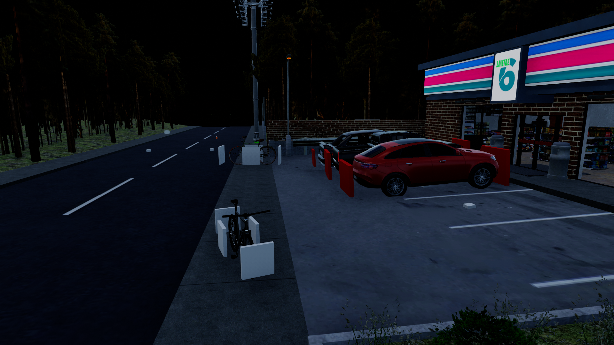
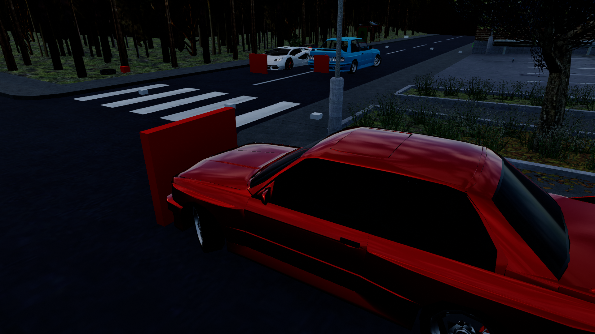

# VantageCV

A synthetic computer vision dataset generator for autonomous vehicle perception research. Built with Unreal Engine 5 and Python, VantageCV produces photorealistic annotated imagery with controlled environmental parameters for training and evaluating object detection models.

---

## Overview

VantageCV generates COCO-formatted datasets through procedural scene randomization in UE5. The system orchestrates vehicle placement, prop spawning, environmental augmentation, and annotation generation through a Python-UE5 bridge using the Remote Control API.

**Technology Stack:** Unreal Engine 5 | Python 3.10 | C++ UE5 Plugin | Remote Control API | COCO Format

---

## Sample Outputs

  
  
  

*Note: Visible mesh cubes are debug geometry used for spawn zones and vehicle collision detection. These will be removed in the final implementation.*

---

## Implemented Features

**Scene Generation**
- 7 distinct capture locations across highway environment
- Procedural prop spawning in 3 locations (barriers, vegetation, signs, furniture, road debris)
- Vehicle spawn zones with location-specific constraints for all 7 locations
- Anchor-based placement system with boundary enforcement

**Environmental Augmentation**
- 6 weather states: clear, overcast, light fog, fog, rain, heavy rain
- 6 time-of-day states: dawn, morning, noon, afternoon, sunset, night
- Per-state manual exposure bias for consistent lighting across conditions

**Detection and Annotation**
- 5 object classes: car, truck, bus, motorcycle, bicycle
- COCO-format 2D bounding box annotations
- Multi-vehicle scenes with 1-6 vehicles per frame
- Automated frame validation with pass/fail/warn status

**Infrastructure**
- Native C++ UE5 plugin for scene control and data capture
- Structured JSON logging with module-level tracing
- Seed-based deterministic generation for reproducibility
- Lumen global illumination, screen-space reflections, Nanite geometry
- Configurable resolution (default 1920x1080)

---

## Current Status

| Component | Status |
|-----------|--------|
| Location zones (7) | Complete |
| Prop spawning (3/7 locations) | Complete |
| Vehicle spawning (7/7 locations) | Complete |
| Weather augmentation (6 states) | Complete |
| Time of day augmentation (6 states) | Complete |
| COCO annotation export | Complete |

---

## Future Development

- Complete prop spawning for remaining 4 locations
- Pedestrian detection support
- 3D bounding box annotations
- Semantic segmentation and depth maps
- Multi-camera perspectives
- Domain-specific configurations
- Synthetic-to-real domain adaptation evaluation

---

## License

Personal portfolio project. All rights reserved.

**Evan Petersen** | Computer Vision & ML Engineering
