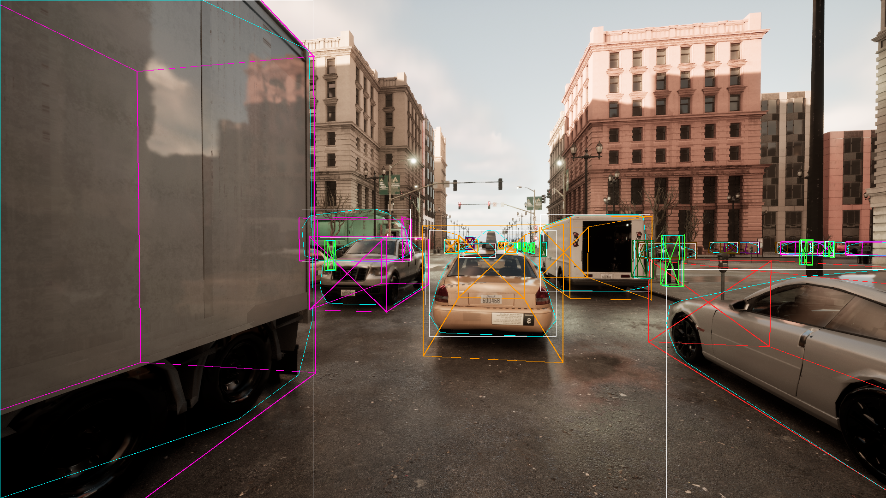
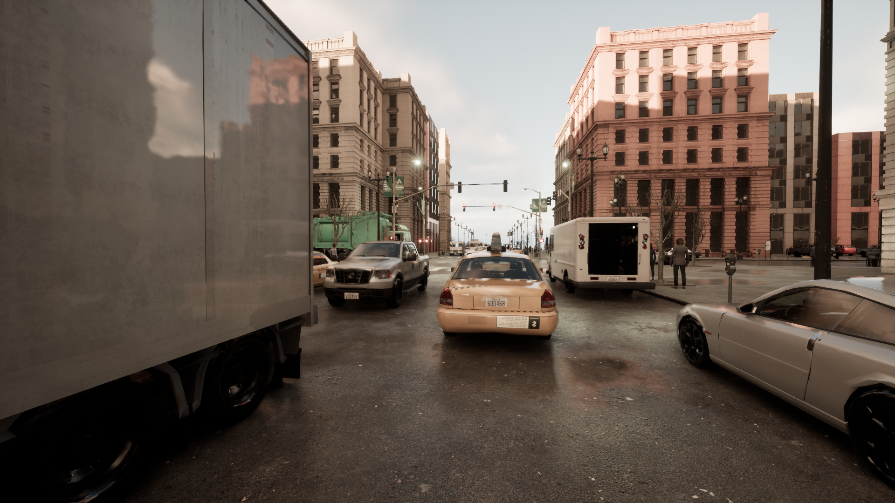
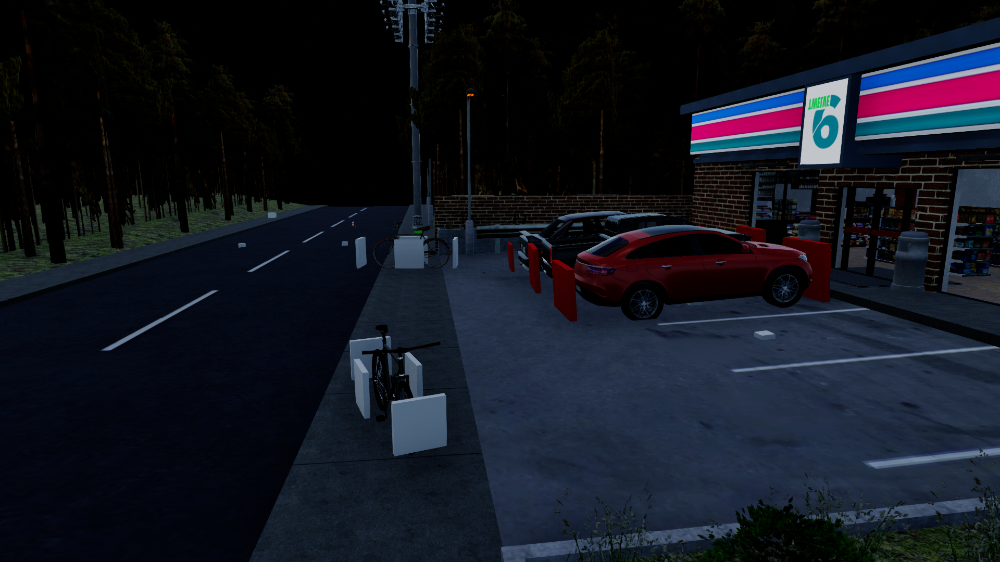

> **This project has been completely rebuilt and massively expanded. [VantageCV Remastered](https://github.com/evanpetersen919/VantageCV-V2) introduces a full procedural city generation engine, depth maps, 3D bounding boxes, instance segmentation, photorealistic City Sample asset integration, and distributed resumable generation.**
>
> 

>   
>   &nbsp;
>   
> 

   

# VantageCV
### Synthetic Autonomous Vehicle Dataset Generator
## Sample Outputs

  
  
  

*Note: Visible mesh cubes are debug geometry used for spawn zones and vehicle collision detection. These will be removed in the final implementation.*

---

## Features

| Category | Details |
|----------|---------|
| **Scene Generation** | 7 capture locations, anchor-based vehicle spawn zones, procedural prop spawning (barriers, vegetation, signs, road debris) |
| **Environmental Augmentation** | 6 weather states, 6 time-of-day states, per-state exposure bias |
| **Annotations** | COCO-format 2D bounding boxes, 5 vehicle classes, 1-6 vehicles per frame, automated frame validation |
| **Infrastructure** | C++ UE5 plugin, seed-based determinism, Lumen GI, Nanite geometry, structured JSON logging |

---

## Status

| Component | Status |
|-----------|--------|
| Location zones (7/7) | Complete |
| Vehicle spawning (7/7 locations) | Complete |
| Prop spawning (3/7 locations) | Complete |
| Weather / time-of-day augmentation | Complete |
| COCO annotation export | Complete |

---

## Documentation

| File | Description |
|------|-------------|
| [ARCHITECTURE.md](ARCHITECTURE.md) | System design and data flow |
| [QUICKSTART.md](QUICKSTART.md) | Zone-detection and capture setup |
| [LIGHTING_POLICY.md](LIGHTING_POLICY.md) | Directional/sky lighting randomization |
| [tests/README.md](tests/README.md) | Running the test suite |
| [scripts/README.md](scripts/README.md) | Capture/generation entry points |
| [configs/README.md](configs/README.md) | Config file reference |

